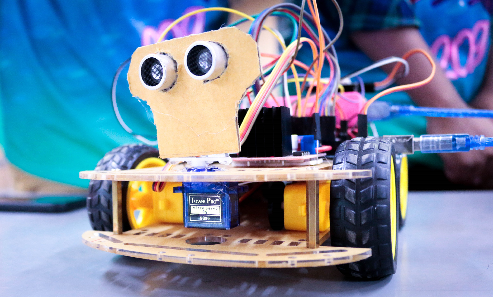

# Multifunctional_Robot_Car

It is an Arduino controlled Robot Car. It has multiple functionalities. So I give this title name 'Multifunctional Robot Car'. The functionalities are :

1. Voice Control
2. Remote Control(Gyro + Manual)
3. Objects Avoiding(Self-moving)

- [ ] NB: For 1 and 2 it needs the smartphone.  
- [ ] The video of this project in [YouTube](https://youtu.be/kdsVhpjAuRs) or [Facebook](https://fb.watch/eGVUIuvwvz/).

It is completely made by me(Md Saif Hossain) and the help of responsive partner (Allen Biswas), as an outcome of the Microprocessor and Assembly Language Programming course that we have completed in the 6th(Summer-2019) trimester under the course coordinator Md Bayazid Rahman. We have made the project for the purpose to present in the project showcase program of CSE Fest-2019 organized by NDUBCC. It is an opportunity for us to express our proficiency in Arduino. This great achievement has been possible for the guidance of Md Bayazid Rahman Sir, and I am proud to have made this.

Guided By : Md Bayazid Rahman  
Creator : Md. Saif Hossain  
Partner : Allen Biswas

### Implementation details :
- It is operated by an Arduino microcontroller chip and sensed by an ultrasonic sensor for measuring the distance to save itself from clashing with other objects or obstacles. The microcontroller follows the instruction of an Arduino code.

- The speed and the direction of each motor which is connected with the corresponding wheel are controlled by the L298N motor driver module. A 9-volt battery supply power and all activities can be seen on a display and recorded in a memory chip.

- It also establishes wireless communication with Bluetooth(HC-05) and Wi-Fi(ESP8266) module. It receives the data of voice using the Bluetooth module and gives access to a remote to the user with the Wi-Fi module.

- In the voice control, the voice is sent using a smartphone(master) and the Car(slave) receives data from the system. In the remote control, users can control it by remote in manual or gyro mode. In object avoiding, the car avoids in front of all objects automatically.

### Tools (Software) :

Remote Control(Gyro + Manual)

- App Name: RemoteXY
- Installer: Google Play
- Support: info@remotexy.com
- [Download Link](https://play.google.com/store/apps/details?id=com.shevauto.remotexy.free&hl=en&gl=US&pli=1) | [Website](https://remotexy.com/)

Voice Control

Arduino Bluetooth Controller

  
- Installer: Google Play
- Support: support@myvalleyapps.com
- [Download Link](https://play.google.com/store/apps/details?id=com.appsvalley.bluetooth.arduinocontroller&hl=en&gl=US) | [Website](https://myvalleyapps.com/)

Arduino Voice Control

  
- Installer: Google Play
- Support: cempehlivan92@gmail.com
- [Download Link](https://play.google.com/store/apps/details?id=appinventor.ai_cempehlivan92.Arduino_Sesli_Kontrol&hl=en&gl=US) | [Website]()

Arduino bluetooth controller

  
- Installer: Google Play
- Support: giugiumig@gmail.com
- [Download Link](https://play.google.com/store/apps/details?id=com.giumig.apps.bluetoothserialmonitor&hl=en&gl=US) | [Website]()

